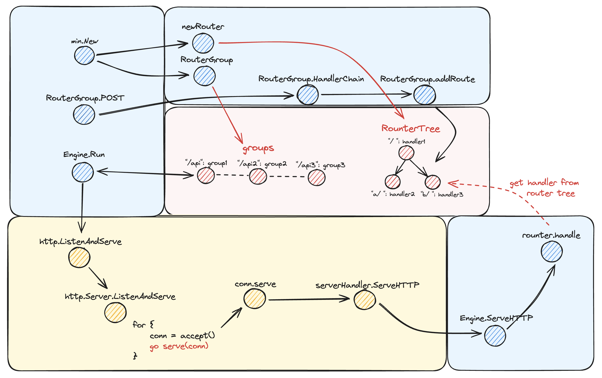

# Min

中文见[README_CHI](static/README_CHI.md)

## What is Min
Min is not a tool for finding the minimum value (x

Min is a lightweight, simplified version of the Gin framework. Min focuses on performance and simplicity, making it suitable for beginners who want to dive deep into Go frameworks.

Min implements most of the basic functions of Gin, including routing, middleware, request/response handling, error handling, and route grouping, for quickly building HTTP services.

## Status
Currently, Min is suitable for learning and small projects, and its performance and stability have been verified in MinerDB.

## Design overview


## Key features
### Routing
Currently supports GET and POST

### Middleware

The middleware mechanism allows custom logic to be inserted during request processing.

Built-in middleware: Currently supports logging and error recovery.

Custom middleware: You can create and use custom middleware to handle pre- and post-request logic.

### context
For web services, it's just about constructing responses `http.ResponseWriter` based on the request `*http.Request`.

However, this is too fine-grained for HTTP services. So we use a context middle layer to simplify it.

At the same time, we can also put dynamic parameters in the context, as well as information generated by some middleware.

### Group
We need to manage a group of APIs uniformly, which makes it easy to add middleware to manage a group of APIs.

## Gettings Started
```go
package main

import (
	"min"
	"net/http"
)

func main() {
	engine := min.New()

	group := engine.Group("/api")

	group.Use(min.Recovery(), min.Logger())

	group.GET("/echo/*name", func(ctx *min.Context) {
		ctx.JSON(http.StatusOK, min.H{"echo": ctx.Params["name"]})
	})
	group.POST("/ping", func(ctx *min.Context) {
		ctx.JSON(http.StatusOK, "pone")
	})

	group.POST("/panic", func(ctx *min.Context) {
		panic("panic")
	})

	engine.Run(":9999")
}
```

## Thanks
Special thanks to @ruanjiancheng for the support. Orz

